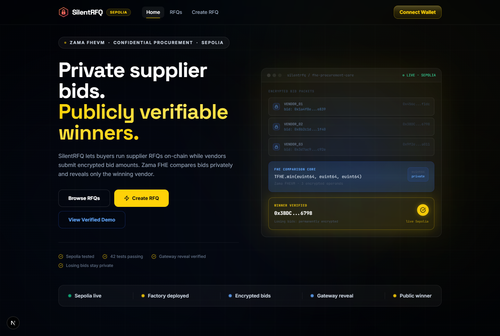
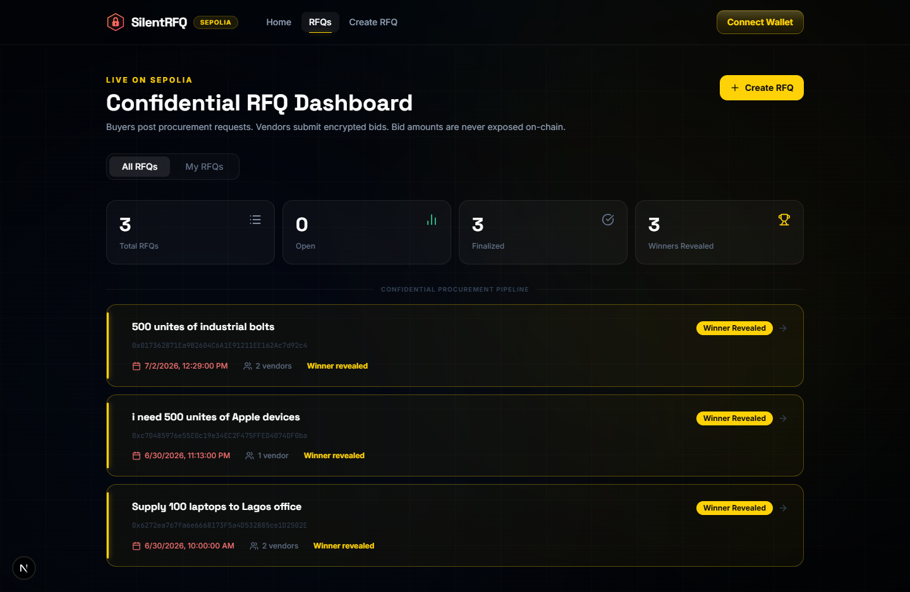
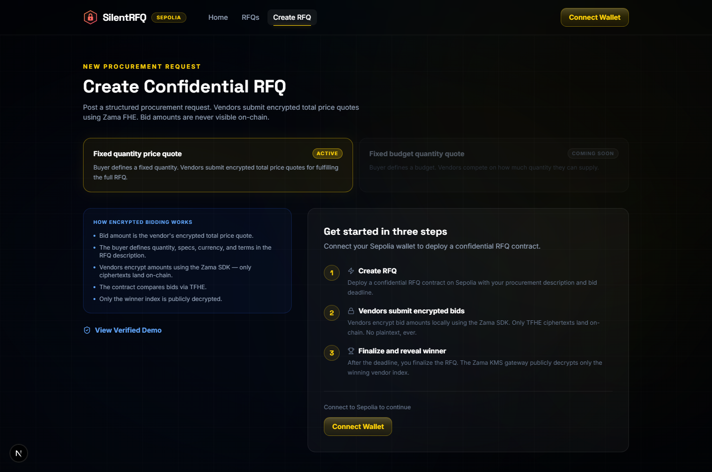
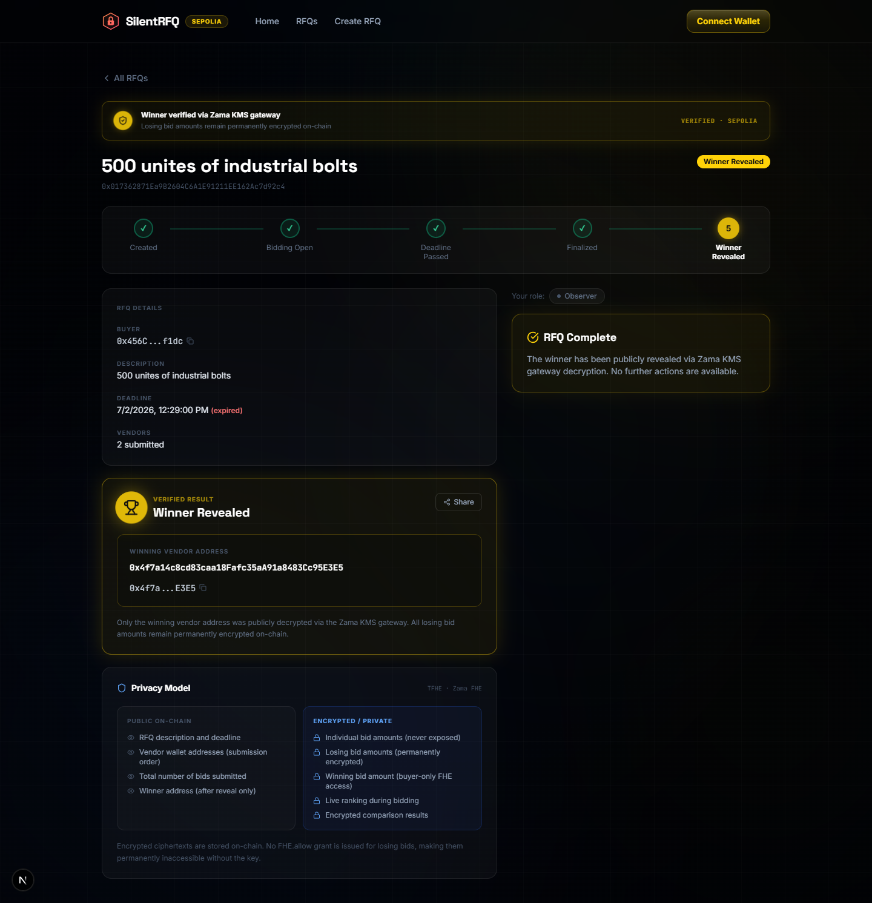

# SilentRFQ

Confidential supplier bidding for RFQs, powered by Zama FHE.

**Zama Season 3 Builder Track**

Quick links:
- Live app: [silentrfq.xyz](https://silentrfq.xyz)
- GitHub: [github.com/GIFTEDLOV/silentrfq](https://github.com/GIFTEDLOV/silentrfq)
- Network: Sepolia
- Factory: `0xE2E283304863dF8C800094e39a8928D84BF330ec`

Shared links carry a custom Open Graph preview image, so posts on X/LinkedIn render a clean SilentRFQ card instead of a bare URL.

---



<table>
  <tr>
    <td></td>
    <td></td>
  </tr>
  <tr>
    <td></td>
    <td></td>
  </tr>
</table>

---

## 1. Problem

Sealed-bid procurement exists so suppliers compete on price without seeing each other's quotes. Putting an RFQ on a public blockchain destroys that guarantee by default.

On a standard EVM chain, every bid amount lands in calldata or contract storage — readable by anyone. A competitor can read a rival's price before the deadline and undercut it by one unit, build a long-term pricing database on every supplier they transact with, or identify the cheapest vendor for a category and approach them directly to cut the buyer out. This isn't a hypothetical exploit; it's the default behavior of every public EVM chain. A procurement dApp without encryption does not preserve the confidentiality model that sealed bidding exists to provide.

## 2. Solution

SilentRFQ runs the entire bid comparison inside Zama's Fully Homomorphic Encryption Virtual Machine (FHEVM). Vendors encrypt their bid amount locally in the browser before it ever touches the network. The smart contract compares encrypted bids against each other and tracks the running best bid — without decrypting a single value. After the deadline, the buyer finalizes the RFQ and only the **winning vendor index** is made publicly decryptable via the Zama KMS gateway. Every losing bid amount stays encrypted on-chain permanently.

## 3. Why FHE matters

Homomorphic encryption lets the contract compute on ciphertexts directly, so there's no window where a plaintext price exists on-chain — not even briefly, and not even to the contract itself.

- A vendor's bid amount is **never visible** to any other party, at any point, including during the live bidding period.
- The contract determines the lowest bid **without knowing what any individual bid is**, using `FHE.lt` for encrypted comparison and `FHE.select` as an encrypted conditional.
- The winning vendor index becomes **publicly decryptable** only after finalization, via `FHE.makePubliclyDecryptable`. Anyone can submit the resulting KMS-signed proof — nobody, including the buyer, can hand-pick the winner.
- The winning bid amount stays **buyer-private** — only the buyer receives `FHE.allow` access after `finalize()`.
- Losing bid ciphertexts remain on-chain forever, but unreadable: no `FHE.allow` grant is ever issued for them, so there is no key that unlocks them.

This is cryptographic privacy enforced by the protocol, not obfuscation or an off-chain trust assumption.

## 4. Features

- Buyer creates an RFQ with a description — including quantity, specs, currency, and terms — and a bid deadline via `SilentRFQFactory`.
- Vendors submit an encrypted total price quote (TFHE `euint64`) for fulfilling the RFQ, using the Zama SDK — no plaintext price ever leaves the browser.
- The contract homomorphically tracks the best bid and best vendor index across every submission.
- Deadline enforcement is on-chain and non-negotiable.
- Buyer finalizes after the deadline; the winning index becomes publicly decryptable.
- Anyone can submit the Zama KMS proof to permissionlessly reveal the winner — no trusted intermediary, no buyer gatekeeping.
- Losing bid amounts remain permanently encrypted, with no decrypt path ever granted.
- Every RFQ page includes a Live Verification panel — one-click copy and Sepolia Etherscan links for the factory, RFQ, and winner addresses, no wallet required.
- Full Sepolia-verified live demo with real encrypted bids, real finalize, real gateway reveal.

## 5. Architecture

SilentRFQ uses a factory pattern: buyers interact with `SilentRFQFactory` to create RFQs, and each RFQ lives in its own `SilentRFQ` contract.

```
Buyer
  │
  └─▶ SilentRFQFactory.createRFQ(description, deadline)
            │
            ├─▶ deploys new SilentRFQ(buyer, description, deadline)
            ├─▶ indexes address in _allRFQs and _rfqsByBuyer[buyer]
            └─▶ emits RFQCreated(rfq, buyer, description, deadline)

Vendor bidding (per SilentRFQ contract)
  └─▶ submitBid(externalEuint64 bid, bytes proof)
            ├─▶ first bid  → stored directly as _bestBid / _bestVendorIndex
            └─▶ later bids → FHE.lt + FHE.select (encrypted comparison, no decryption)

Finalize + reveal
  └─▶ finalize()                         — buyer only, after deadline
            └─▶ FHE.makePubliclyDecryptable(_bestVendorIndex)
  └─▶ callbackRevealWinner(handles, cleartexts, proof)  — anyone, after finalize
            └─▶ FHE.checkSignatures(...) verifies the Zama KMS proof on-chain
            └─▶ winnerAddress() = vendors[revealedWinnerIndex]
```

Each `SilentRFQ` contract is independent and self-contained. The factory is stateless with respect to bidding — it only tracks addresses.

```
silentrfq/
├── contracts/
│   ├── SilentRFQFactory.sol   # Entry point — deploys and indexes SilentRFQ contracts
│   ├── SilentRFQ.sol          # Per-RFQ contract — confidential FHE bidding logic
│   └── FHECounter.sol         # Zama template example (unchanged)
├── test/
│   ├── SilentRFQFactory.ts    # Factory test suite
│   ├── SilentRFQ.ts           # SilentRFQ test suite
│   └── FHECounter.ts          # Template example tests (unchanged)
├── deploy/
│   └── deploy.ts
├── frontend/                  # Next.js app — wallet connect, RFQ dashboard, bid/finalize/reveal
├── hardhat.config.ts
└── package.json
```

## 6. Live verified demo

Everything below is live and independently verifiable on Sepolia — no mocked data, no simulated decryption.

| | Address |
|---|---|
| **Factory** | `0xE2E283304863dF8C800094e39a8928D84BF330ec` |
| **Completed RFQ** | `0x6272ea767fa6e6668173F5a4D532885ce1D2502E` |
| **Winner** | `0x3BDCd4A4A6E4E11668b43004B52049b3167e6798` |

Open the completed RFQ on the live app and confirm it yourself using the **Live Verification** panel on the RFQ detail page — it links directly to Sepolia Etherscan for the factory, the RFQ, and the winner, with no wallet connection required. Confirm: the RFQ was finalized, `callbackRevealWinner` succeeded with a real KMS-signed proof, and the winner address matches `winnerAddress()` on-chain.

## 7. Demo flow

1. **Create** — Connect a Sepolia wallet, go to `/create`, submit a description and deadline. `SilentRFQFactory.createRFQ` deploys a new `SilentRFQ` contract.
2. **Bid** — From a vendor wallet, open the RFQ and submit an encrypted total price quote for fulfilling it. The Zama SDK encrypts the amount client-side into a `euint64` ciphertext with a validity proof before it's sent.
3. **Compare (automatic)** — Each new bid is homomorphically compared against the current best bid on-chain. No plaintext value exists at any point.
4. **Finalize** — After the deadline, the buyer calls `finalize()`. This registers the winning index for public decryption and grants the buyer private access to the winning bid amount.
5. **Reveal** — Anyone submits the Zama KMS proof via `callbackRevealWinner`. The winner address becomes public. Every losing bid stays encrypted, permanently.

## 8. Local development

**Contracts**

```bash
npm install
npm run compile
npm run test
```

**Frontend, against a local Hardhat node**

```bash
# terminal 1
npx hardhat node

# terminal 2
npx hardhat run scripts/deployFactory.ts --network localhost
# copy the printed NEXT_PUBLIC_FACTORY_ADDRESS

cd frontend
npm install
npm run dev
```

Open [http://localhost:3000](http://localhost:3000).

**Frontend, against Sepolia**

Point the env vars below at the deployed factory and Sepolia chain ID instead, then `npm run dev` or `npm run build && npm run start`.

## 9. Environment variables

Copy `.env.local.example` to `frontend/.env.local` (or set these in Vercel project settings for production):

| Variable | Description |
|---|---|
| `NEXT_PUBLIC_FACTORY_ADDRESS` | Deployed `SilentRFQFactory` address for the target network |
| `NEXT_PUBLIC_CHAIN_ID` | `31337` for a local Hardhat node, `11155111` for Sepolia |
| `NEXT_PUBLIC_WALLETCONNECT_PROJECT_ID` | From [cloud.walletconnect.com](https://cloud.walletconnect.com) — not required for MetaMask/injected wallets |

## 10. Testing

```
42 passing
 1 pending  ← Sepolia-only template test, correctly skipped locally
```

**SilentRFQ:**
- Deployment: zero-buyer rejection, past/equal-to-now deadline rejection, correct initial state
- `submitBid`: deadline enforcement, duplicate prevention, first-bid path, FHE comparison correctness (lower/higher/equal), three-vendor selection, vendor ordering
- `finalize`: non-buyer, pre-deadline, no-bids, success, exact-boundary, double-finalize
- `callbackRevealWinner`: not-finalized, already-revealed, empty handles, wrong handle, tampered proof, tampered cleartexts, valid proof success, permissionless caller, full three-vendor gateway flow

**SilentRFQFactory:**
- `createRFQ`: buyer set correctly, address returned, `RFQCreated` event, invalid deadline propagation
- `getRFQs` / `getRFQsByBuyer`: correct scoping, empty-state handling
- `rfqCount`: zero initial, increments correctly

Run it yourself: `npm run test`.

## 11. Tech stack

**Contracts**
- [Zama FHEVM](https://docs.zama.ai/fhevm) — fully homomorphic encryption for the EVM
- [`@fhevm/solidity`](https://www.npmjs.com/package/@fhevm/solidity) — FHE Solidity library
- [`@fhevm/hardhat-plugin`](https://www.npmjs.com/package/@fhevm/hardhat-plugin) — mock FHEVM environment for local testing
- Solidity 0.8.27, Hardhat, TypeScript test suite

**Frontend**
- Next.js (App Router) + TypeScript
- [Zama Relayer SDK](https://www.npmjs.com/package/@zama-fhe/relayer-sdk) — client-side bid encryption
- wagmi + viem + RainbowKit — wallet connection and contract calls
- Tailwind CSS — dark, motion-driven UI

## 12. Demo video script

1. **Hook (0:00–0:10)** — "Every public-chain RFQ leaks supplier pricing to competitors. SilentRFQ fixes that with real homomorphic encryption — not obfuscation."
2. **The problem (0:10–0:25)** — Show a bid amount sitting in plaintext calldata on a standard EVM explorer. Point out any wallet can read it before the deadline.
3. **Create an RFQ (0:25–0:45)** — Live on Sepolia: connect wallet, `/create`, submit description + deadline, show the deployed contract address.
4. **Submit an encrypted bid (0:45–1:15)** — Switch to a vendor wallet, submit a bid, and show the network tab / calldata — only a ciphertext, never a number.
5. **Explain the FHE comparison (1:15–1:40)** — Walk through `FHE.lt` + `FHE.select` in `SilentRFQ.sol`: the contract picks the lower bid without ever seeing either value in plaintext.
6. **Finalize + reveal (1:40–2:10)** — Call `finalize()` after the deadline, then submit the KMS proof via `callbackRevealWinner`. Show the winner address appearing on-chain, live.
7. **Close (2:10–2:30)** — Open the RFQ detail page's privacy panel: losing bids stay encrypted forever. "This is Zama FHEVM doing exactly what it's for — confidential computation, public proof."

## 13. X article / announcement points

- Sealed-bid procurement, but the seal is cryptographic — built on Zama FHEVM, not a promise.
- Vendors submit `euint64` ciphertexts. The contract compares bids with `FHE.lt` / `FHE.select`. No plaintext bid amount ever exists on-chain, not even transiently.
- The winner is revealed through a permissionless, KMS-signed proof — anyone can trigger the reveal, nobody can pick the winner.
- Losing bids aren't "hidden" by convention — there is no `FHE.allow` grant for them, so there is no key that unlocks them, ever.
- Live and verifiable on Sepolia today: real factory, real encrypted bids, real gateway reveal. Addresses in the README, not screenshots.
- Built for the Zama Season 3 Builder Track: an audited-pattern FHE contract, a full test suite, and a frontend built to feel like a real product — not a slide deck.

---

## Template base

This project was bootstrapped from the [Zama FHEVM Hardhat Template](https://github.com/zama-ai/fhevm-hardhat-template).

## License

BSD-3-Clause-Clear. See [LICENSE](LICENSE).

## Support

- [FHEVM Documentation](https://docs.zama.ai/fhevm)
- [Zama Discord](https://discord.gg/zama)
